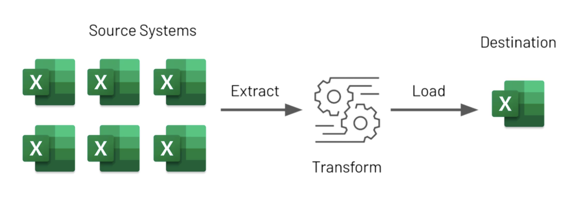

# ETL Excel



## About the Project 🗃️

This repository aims to serve as a portfolio. The goal is to demonstrate the benefits of software development best practices in the data field and provide a standardized structure to start engineering, science, and data analysis projects.

**The main focus is on best practices, automation, testing, and documentation.**

### Requirements 🚧

There are two things to set up before starting any Python project:

- Python version control.
- Package and virtual environment management.

#### Pyenv 🔖

```Pyenv``` allows you to manage **multiple Python versions on the same system**, ensuring you can use the correct version for each project.

#### Poetry 📦

```Poetry``` is a tool for managing **dependencies**, **virtual environments**, and Python project packaging.

**Advantages of Poetry:**

- Centralized management in the ```pyproject.toml``` file.
- Automatic creation of isolated virtual environments.
- Simplified installation flow.

**Poetry automatically uses the Python version configured locally in the project via Pyenv to ensure seamless integration between the tools.**

### Dependencies ➕

#### Project Dependencies 🔧

These are the essential dependencies required for the project to run. They include libraries for processing and handling Excel files.

- ```pandas```: Library for data analysis and manipulation.
- ```openpyxl```: Library for reading and writing Excel files.

#### Development Dependencies 💻

These dependencies are needed during project development, such as tools for code formatting, linting, and task automation.

- ```taskipy```: For automating tasks like running scripts and tests.
- ```pre-commit```: For configuring pre-commit hooks to ensure the code adheres to project conventions.
- ```pip-audit```: For auditing dependencies and checking for vulnerabilities.
- ```pydocstyle```: To check code documentation style.
- ```blue```: Code formatter similar to Black.
- ```isort```: For consistently organizing imports.
- ```loguro```: For logging.

#### Testing Dependencies 🧪

These dependencies are required for running the project tests, such as the testing framework and its plugins.

- ```pytest```: Framework for writing and running automated tests.

#### Documentation Dependencies 📚

These dependencies are used to generate and serve the project documentation. They include tools for building documentation sites and generating dynamic content.

- ```mkdocstrings-python```: For rendering Python docstrings in documentation generated by MkDocs.
- ```pygments```: For syntax highlighting in the documentation.
- ```pymdown-extensions```: Extensions for MkDocs, enabling advanced Markdown usage.
- ```mkdocs-bootstrap386```: Bootstrap theme for MkDocs.
- ```mkdocs-material```: Material theme for MkDocs.
- ```mkdocs```: Tool for creating documentation websites using Markdown.

### Installation and Configuration

1. Clone the repository:

    ```bash
    git clone https://github.com/rafaeljurkfitz/etl-excel.git
    cd etl-excel
    ```

2. Set up the correct Python version using `pyenv`:

    ```bash
    pyenv install 3.12.0
    pyenv local 3.12.0
    ```

3. Configure Poetry for Python version 3.12.0 and activate the virtual environment:

    ```bash
    poetry env use 3.12.0
    poetry shell
    ```

4. Install the project dependencies:

    ```bash
    poetry install
    ```

5. Run the tests to ensure everything is correct and working:

    ```bash
    task test
    ```

6. Run the command to view the project documentation:

    ```bash
    task doc
    ```

7. Start the pipeline execution by running the command to initiate the ETL:

    ```bash
    task run
    ```

8. Check the ```data/output``` folder path to ensure the generated file is correct.

## Contact

For questions, suggestions, or feedback:

- **Rafael Jurkfitz** - [rjurkfitz@gmail.com](mailto:rjurkfitz@gmail.com)

## License

This project is licensed under the MIT License.
